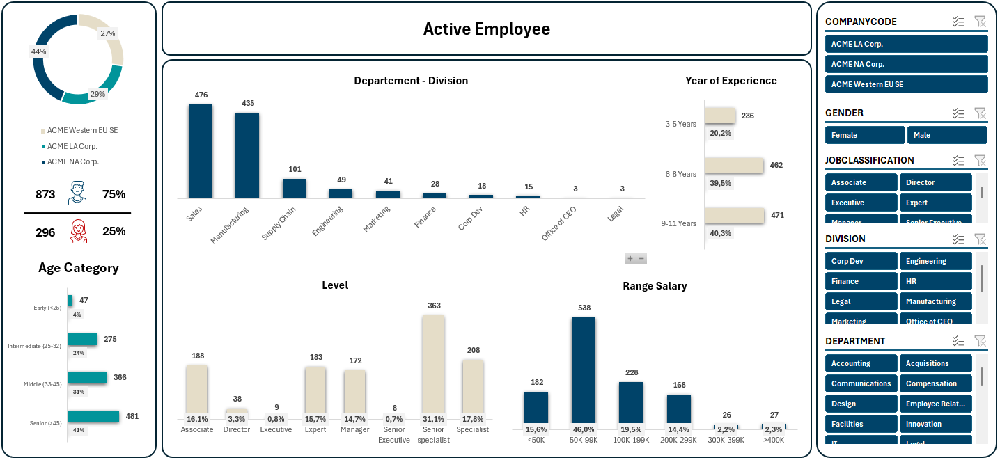
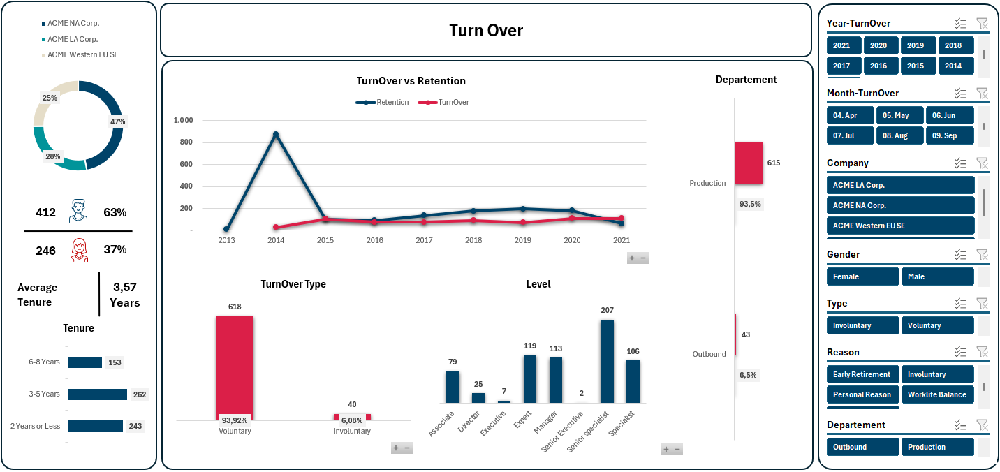
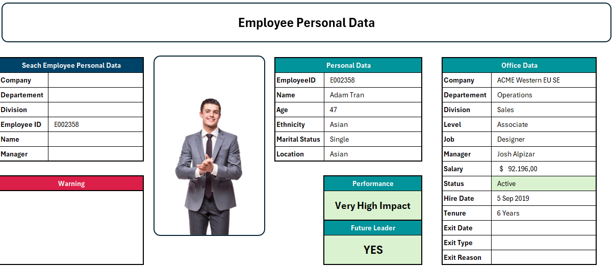
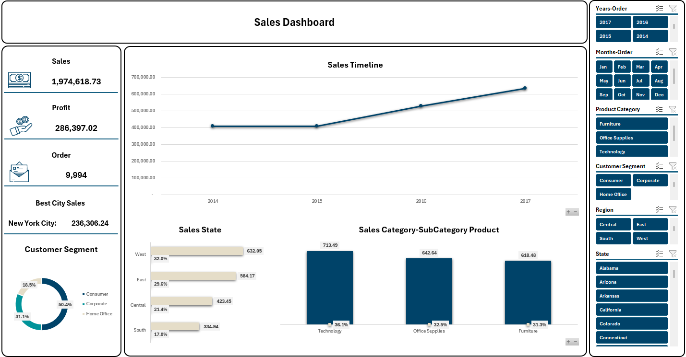
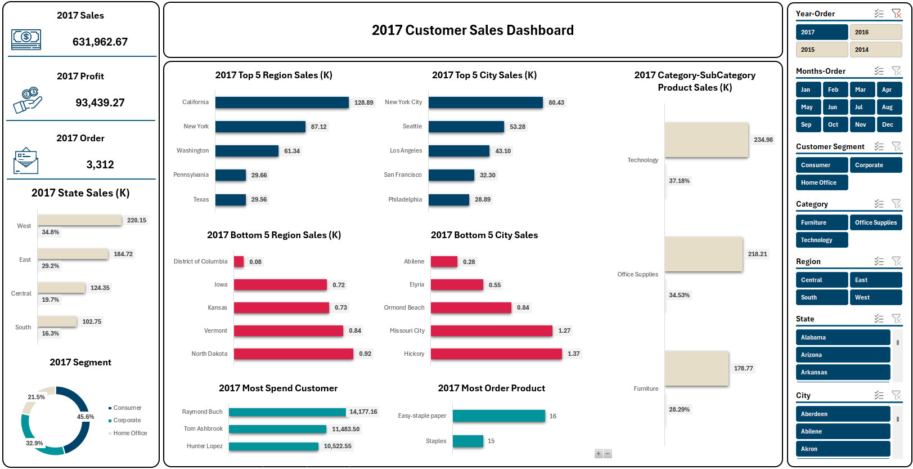
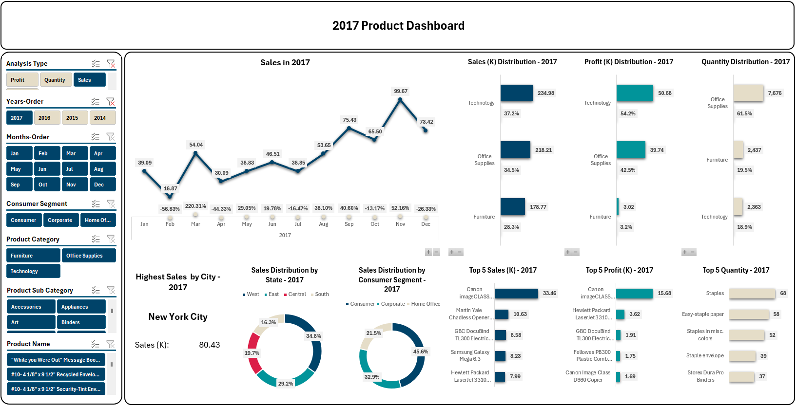
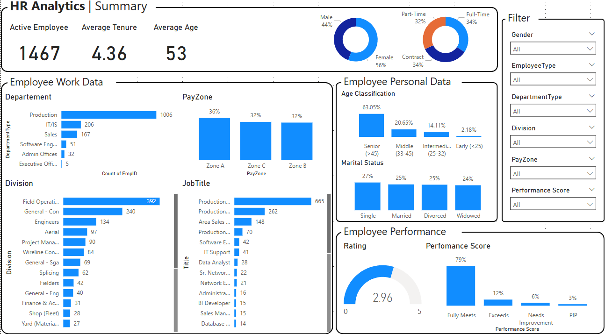
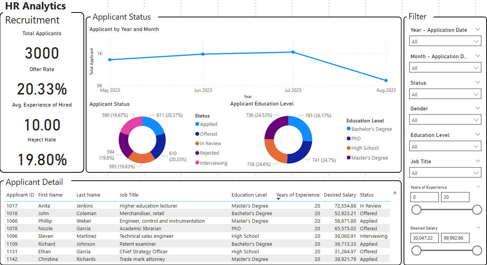
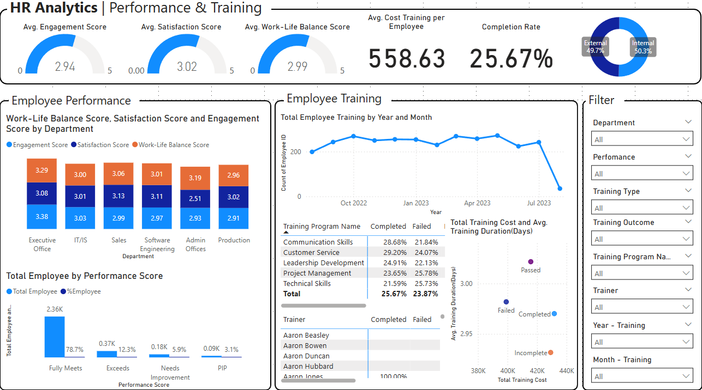
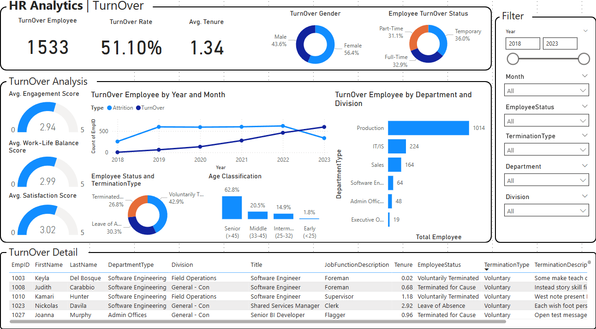

# Dashboard Development

## 1. Excel

### 1.1. HR Analytics

#### Project Description

This project presents a comprehensive HR analytics dashboard built using **Power Query** and **Power Pivot** in Microsoft Excel. The dashboard provides valuable insights into workforce demographics, employee turnover trends, and individual employee profiles to support data-driven human resource decisions.

#### Goals
- Analyze active employee data across company locations, age groups, job levels, and salary ranges.
- Monitor employee turnover and retention trends over time, including reasons and classifications.
- Provide detailed personal employee data for performance assessment and HR strategic planning.

> **Source**: Project hosted on GitHub  
> [View Project on GitHub]([https://github.com/denindrap23/Machine-Learning/edit/main/Investigate-Hotel-Business-using-Data-Visualization](https://github.com/denindrap23/Dashboard_Development/tree/main/Excel/HR_Analytics))

#### Dashboard Previews

| Active Employee | Turnover | Personal Data |
|-----------------|----------|---------------|
|  |  |  |

### 1.2. Sales Analytics Project

#### Project Description

The Sales Analytics project aims to provide a comprehensive analysis of sales performance, customer behavior, and product distribution over time. By utilizing powerful data processing and visualization tools, the project enables decision-makers to gain actionable insights for strategic business improvements.

#### Goals
The main objective of this project is to analyze and visualize sales data from multiple dimensions, including:
- **Sales Summary**: Overall revenue, profit, and number of orders
- **Customer Analytics**: Regional performance, top cities, customer segments, and purchasing behavior
- **Product Performance**: Sales by product category, sub-category, and individual product, including distribution by sales volume, profit, and quantity

> **Source**: Project hosted on GitHub  
> [View Project on GitHub](https://github.com/denindrap23/Dashboard_Development/tree/main/Excel/Sales_Analytics)

#### Dashboard Previews

| Sales Summary | Customer Sales | Product Performance |
|-----------------|----------|---------------|
|  |  |  |

## 2. Power BI

### 2.1. HR Analytics

#### Project Description

A business intelligence project designed to visualize and analyze HR metrics for better data-driven decisions across recruitment, performance management, training effectiveness, and employee turnover. This HR Analytics project leverages four structured datasets to build an interactive Power BI dashboard that provides a holistic view of the organization's human resources data. The dashboard enables HR teams and decision-makers to monitor key employee metrics, identify areas of improvement, and improve strategic planning through real-time insights.

#### Goals
- Analyze active employee data across company locations, age groups, job levels, and salary ranges.
- Monitor employee turnover and retention trends over time, including reasons and classifications.
- Provide detailed personal employee data for performance assessment and HR strategic planning.

> **Source**: Project hosted on GitHub  
> [View Project on GitHub](https://github.com/denindrap23/Dashboard_Development/tree/main/Power-BI/HR_Analytics)

#### Dashboard Previews

| Summary | Recruitment | Perfomance & Training | Turnover |
|---------------|---------------|---------------|---------------|
|  |  |  |  |
